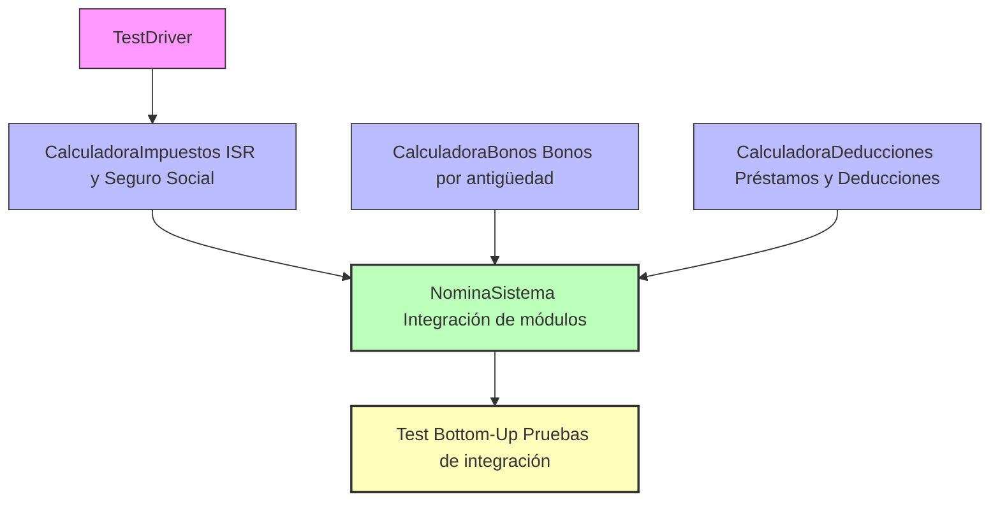
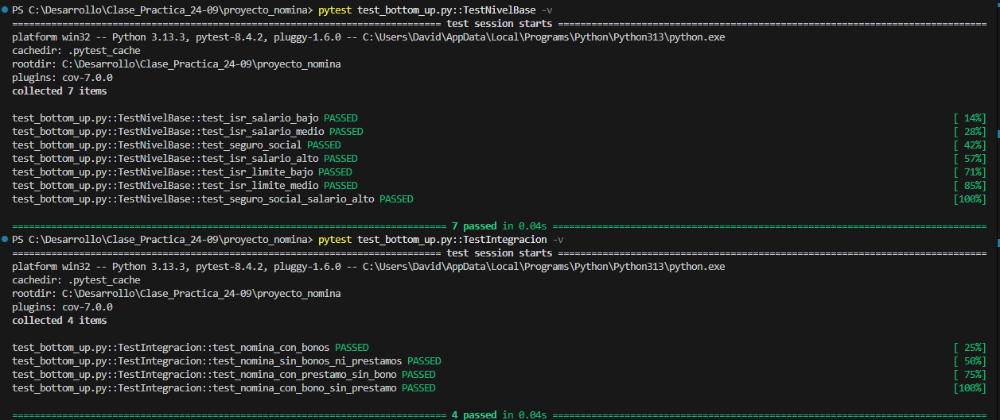
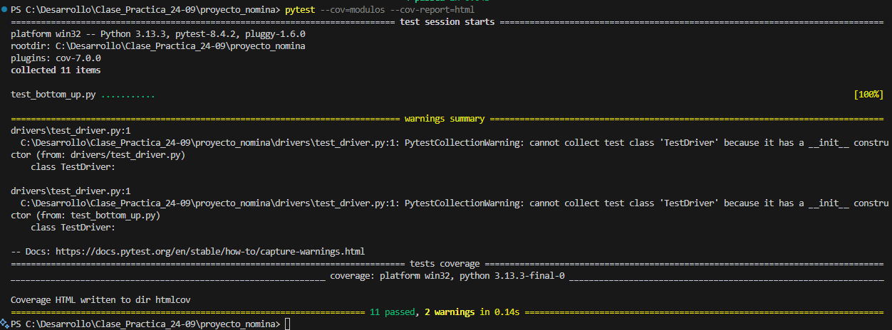

# 📊 Proyecto Nómina – Pruebas Bottom-Up

Este proyecto implementa un **sistema de nómina** en Python, acompañado de pruebas con un enfoque de **integración Bottom-Up**.  
La idea es comenzar probando los módulos más pequeños (cálculos individuales), luego integrarlos progresivamente hasta obtener el sistema de nómina completo.

---

## 🚀 Objetivos
- Practicar la **integración de módulos con enfoque Bottom-Up**.
- Validar los cálculos de:
  - **ISR (Impuesto Sobre la Renta)**
  - **Seguro Social**
  - **Bonos por antigüedad**
  - **Deducciones (ejemplo: préstamos)**
- Obtener **cobertura de pruebas** con `pytest-cov`.

---

## 📂 Estructura del proyecto

```bash
proyecto_nomina/
│── images/ 
│ ├── HTML.png
│ ├── Summary.png
│ ├── TestPass.png
│── modulos/
│ ├── calculadora_impuestos.py # Cálculo de ISR y Seguro Social
│ ├── calculadora_bonos.py # Cálculo de bonos por antigüedad
│ ├── calculadora_deducciones.py # Cálculo de deducciones (ej. préstamos)
│── drivers/
│ └── test_driver.py # Driver auxiliar para pruebas unitarias
│── nomina_sistema.py # Integra todos los módulos
│── test_bottom_up.py # Pruebas unitarias e integración
│── README.md # Documentación
```
---

## ⚙️ Instalación

Clonar el repositorio y crear un entorno virtual:

git clone https://github.com/tu_usuario/proyecto_nomina.git
cd proyecto_nomina

python -m venv venv
source venv/bin/activate   # En Linux/Mac
venv\Scripts\activate      # En Windows

Instalar dependencias:

pip install pytest pytest-cov

---

## ▶️ Uso
Ejecutar todas las pruebas:

pytest

Generar reporte de cobertura en HTML:

pytest --cov=modulos --cov-report=html

Abrir el reporte:

start htmlcov/index.html   # Windows
open htmlcov/index.html    # MacOS

---

## 🧪 Estrategia Bottom-Up
El enfoque Bottom-Up se basa en probar primero las unidades más pequeñas (cálculos aislados), luego integrar cada parte hasta cubrir el sistema completo.

---

## 📐 Diagrama de Integración Bottom-Up
Este diagrama muestra cómo se van integrando y probando los componentes:


---

## 🔎 Lectura del diagrama:

Nivel 0: TestDriver permite probar módulos individuales como CalculadoraImpuestos.

Nivel 1: Se prueban de manera aislada los módulos Impuestos, Bonos y Deducciones.

Nivel 2: NominaSistema integra todos los cálculos para obtener el salario neto.

Nivel 3: test_bottom_up.py valida escenarios completos de nómina (con bonos, con préstamos, sin beneficios, etc.).

---

## ✅ Cobertura de pruebas

Se cubren los siguientes escenarios:

Unitarios (Nivel 1):

ISR con salario bajo, medio, alto y límites.

Seguro social en diferentes salarios.

Integración (Nivel 2 y 3):

Nómina con bono + préstamo.

Nómina sin bonos ni préstamos.

Nómina solo con préstamo.

Nómina solo con bono.

---

## 🖼️ Capturas de pantalla

### Ejecución de pruebas


### Reporte de cobertura (con pytest-cov)


### Reporte HTML generado


